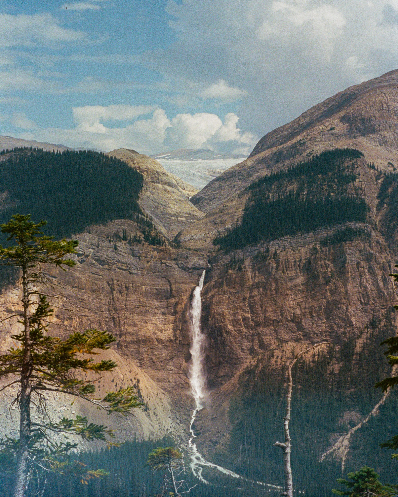

# The Traversal

A film photography portfolio by Jacob Nadal — landscapes and quiet moments,
shot mostly on 35mm.

**Live:** [www.thetraversal.ca](https://www.thetraversal.ca)



## The site

Two pages, no build step, no framework.

- **`index.html`** — the landing sequence. Full-bleed photographs and silent
  loops in an infinite scroll; one gesture moves one slide. Click anywhere to
  enter.
- **`mosaic.html`** — the gallery. A masonry of everything, with a lightbox for
  photographs and fullscreen playback for films.
- **`gallery-manifest.js`** — the running order of the mosaic. This is the only
  file you edit to add, remove or reorder work.

Plain HTML, CSS and JavaScript. Cormorant Garamond and Darker Grotesque from
Google Fonts. Deployed from `main` to GitHub Pages.

## Layout

```
├── index.html              landing sequence
├── mosaic.html             gallery
├── gallery-manifest.js     gallery running order — edit this
├── assets/                 everything the site serves
│   ├── photos/             web-sized photographs (long edge 2200px)
│   ├── video/              web-sized loops (long edge 1920px)
│   │   └── mobile/         portrait crops, landing page only
│   ├── posters/            first frame of each loop
│   └── site/               favicon, about portrait
├── scripts/
│   ├── optimize-photos.py  _masters/photos → assets/photos
│   ├── encode-video.sh     _masters/video  → assets/video + posters
│   └── curate-order.py     re-sequences the mosaic for visual variety
└── _masters/               originals — git-ignored, never published
```

`assets/` holds only web copies, and every one of them is generated from
`_masters/` by the two scripts. Originals never enter the repository, which is
what keeps the published site small enough for Pages to build quickly.

## Adding work

1. Drop the originals into `_masters/photos/` or `_masters/video/`. Any size,
   any orientation — they are never published.

2. Run whichever applies:

   ```bash
   python3 scripts/optimize-photos.py    # photographs
   ./scripts/encode-video.sh             # films
   ```

   Both skip anything already built; pass `--force` to redo. Photographs come out
   at 2200px on the long edge as progressive JPEG. Films come out at 1920px on
   the long edge with a keyframe every second, and a poster taken from their own
   first frame. Orientation is preserved, so a vertical clip stays vertical.

3. Add a line to `gallery-manifest.js` where you want it to appear:

   ```js
   image('assets/photos/portra-041.jpg', 2200, 1470),
   video('assets/video/garibaldi.mp4', 1080, 1920),
   ```

   The two numbers are the file's real pixel dimensions. They hold the tile's
   shape before the media loads so the masonry doesn't jump while someone is
   reading it. Check them with:

   ```bash
   sips -g pixelWidth -g pixelHeight assets/photos/portra-041.jpg
   ```

4. Bump `ASSET_VERSION` at the top of `gallery-manifest.js` so browsers refetch.

5. Optionally re-sequence the gallery:

   ```bash
   python3 scripts/curate-order.py           # propose an order
   python3 scripts/curate-order.py --write   # apply it
   ```

## Why the running order is generated

The mosaic is CSS `column-count`, which fills **column-major**. With 70 tiles
over three columns the browser puts items 0–21 in the first column, 22–45 in the
second and 46–69 in the third. So the tile beside item 0 is item ~22, not item 1
— and the first screenful is the top of every column at once. Sequencing by hand
cannot control that, and the split points move at every breakpoint.

`curate-order.py` measures each photograph (mean CIELAB colour, tone, saturation,
hue, aspect), reproduces that balanced fill at 2, 3 and 4 columns, derives the
real neighbour pairs from the resulting geometry, and anneals the order so that
no two similar tiles touch at any width, films stay evenly spread, and the tops
of the columns — the whole first impression — contrast strongly with each other.

Edit the order by hand whenever you like; the script is a starting point, not a
gate.

Photographs are named after the film stock they were shot on
(`portra-008.jpg`, `gold-021.jpg`, `cinestill400d-030.jpg`); the earlier
numbered scans keep their original names.

## The landing sequence

Its slides live in the `LANDING_SLIDES` array near the top of `index.html`'s
script. Films are named by slug and resolved at runtime to the right encode:

```js
{ type: 'video', clip: 'icefields-1', title: 'Icefields Parkway', sub: 'Banff National Park' },
{ type: 'image', src: 'assets/photos/01.jpg', title: 'Takakkaw Falls', sub: 'Yoho National Park' },
```

A `clip` needs four files, all produced by `encode-video.sh`:
`assets/video/<slug>.mp4`, `assets/video/mobile/<slug>.mp4`, and posters
`assets/posters/<slug>.jpg` and `<slug>-m.jpg`. Phones get the portrait crop —
`object-fit: cover` otherwise reduces a 16:9 frame to a narrow strip and upscales
it, which costs more visible quality than the codec does. To add a new landing
film, add its slug to `MOBILE_CROPS` in the script so the portrait crop is built.

## Running it locally

```bash
python3 -m http.server 8000
```

Then open <http://localhost:8000>. There is nothing to install or compile.

## Requirements for the scripts

```bash
brew install ffmpeg
python3 -m pip install Pillow
```

## Contact

Jacob Nadal — jacob24@rogers.com — Vancouver, British Columbia
[@thetraversal](https://www.instagram.com/thetraversal/)

## License

MIT — see [LICENSE](LICENSE).

---

*© 2026 Jacob Nadal*
